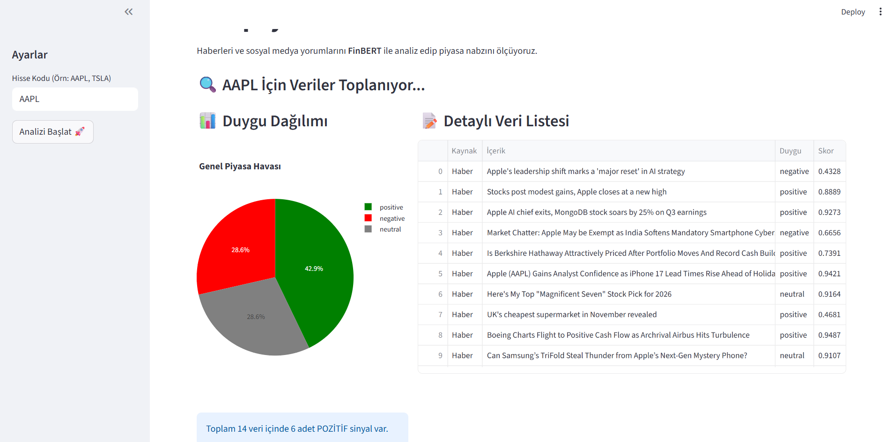

# 📈 Borsa Nabzı: Yapay Zeka Destekli Duygu Analizi

Bu proje, finansal piyasaların nabzını tutmak için geliştirilmiş uçtan uca bir **Veri Analitiği ve Yapay Zeka** uygulamasıdır. 

Hisse senetleri hakkında çıkan haberleri ve sosyal medya konuşmalarını tarar, Google'ın **FinBERT** modeli ile "Duygu Analizi" yapar.

## 🚀 Özellikler
- **Veri Madenciliği:** `yfinance` ile canlı veri.
- **Yapay Zeka:** `FinBERT` ile metin analizi.
- **Dashboard:** `Streamlit` ile görselleştirme.

---
Developed by Selami Kolcu
